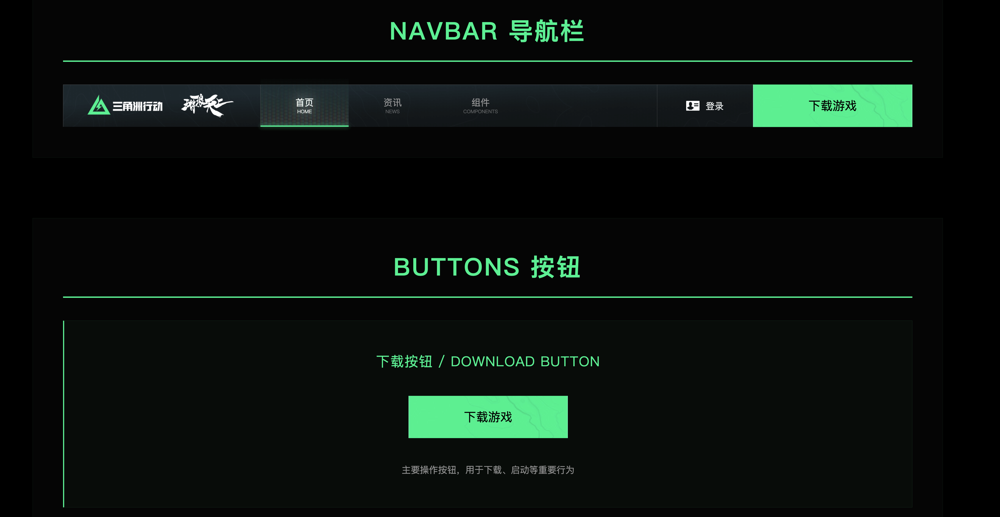
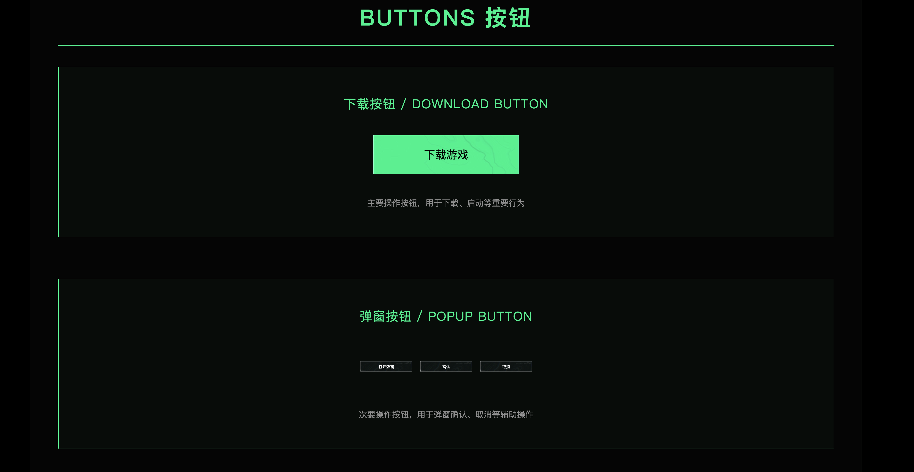
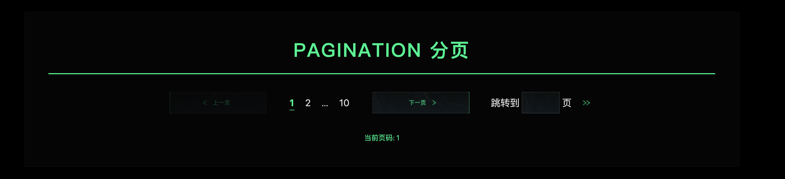
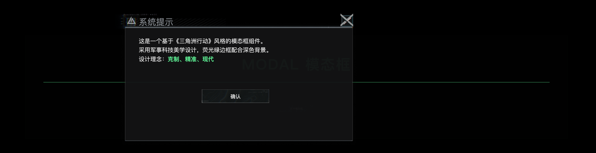

# DF React UI 🎖️ 三角洲行动UI前端

> 基于《三角洲行动》军事科技风格的 React 组件库

[](https://opensource.org/licenses/MIT)
[](https://www.typescriptlang.org/)
[](https://reactjs.org/)

## ✨ 特性

- 🎯 **军事科技风格** - 灵感来源于现代军事装备HUD界面
- 💚 **荧光绿主色** - 夜视仪绿色，象征高科技与精准
- ⚡ **TypeScript** - 完整的类型定义支持
- 📦 **开箱即用** - 简洁的 API 设计
- 🎨 **极简美学** - 减法设计，克制而现代
- 📱 **响应式** - 完美适配各种屏幕尺寸

## 📸 效果预览

### 整体效果

<div align="center">
  
  <p><em>组件库整体展示</em></p>
</div>

### 核心组件

<table>
  <tr>
    <td align="center">
      <br>
      <strong>Button 按钮</strong><br>
      <em>多种变体和状态</em>
    </td>
    <td align="center">
      <br>
      <strong>Pagination 分页</strong><br>
      <em>极简数字页码设计</em>
    </td>
  </tr>
  <tr>
    <td align="center" colspan="2">
      <br>
      <strong>Modal 模态框</strong><br>
      <em>军事科技风格弹窗</em>
    </td>
  </tr>
</table>

## 🚀 快速开始

### 安装

```bash
npm install df-react-ui
# or
yarn add df-react-ui
# or
pnpm add df-react-ui
```

### 使用

```tsx
import React, { useState } from 'react';
import { Button, Pagination, Modal } from 'df-react-ui';
import 'df-react-ui/dist/style.css';

function App() {
  const [visible, setVisible] = useState(false);
  const [page, setPage] = useState(1);

  return (
    <div>
      {/* 按钮 */}
      <Button variant="primary" onClick={() => setVisible(true)}>
        打开模态框
      </Button>

      {/* 分页 */}
      <Pagination
        current={page}
        total={100}
        onChange={(page) => setPage(page)}
        showJumper
      />

      {/* 模态框 */}
      <Modal
        visible={visible}
        title="系统提示"
        onClose={() => setVisible(false)}
      >
        <p>这是一个军事科技风格的模态框</p>
      </Modal>
    </div>
  );
}
```

## 📦 组件

### Button 按钮

```tsx
import { Button } from 'df-react-ui';

// 不同变体
<Button variant="primary">主要按钮</Button>
<Button variant="accent">强调按钮</Button>
<Button variant="secondary">次要按钮</Button>
<Button variant="ghost">幽灵按钮</Button>

// 不同尺寸
<Button size="small">小号</Button>
<Button size="medium">中号</Button>
<Button size="large">大号</Button>

// 状态
<Button loading>加载中...</Button>
<Button disabled>禁用</Button>
```

**Props:**

| 属性 | 类型 | 默认值 | 说明 |
|------|------|--------|------|
| variant | `'primary' \| 'accent' \| 'secondary' \| 'ghost'` | `'primary'` | 按钮变体 |
| size | `'small' \| 'medium' \| 'large'` | `'medium'` | 按钮尺寸 |
| block | `boolean` | `false` | 是否为块级按钮 |
| loading | `boolean` | `false` | 是否加载中 |
| disabled | `boolean` | `false` | 是否禁用 |

### Pagination 分页

```tsx
import { Pagination } from 'df-react-ui';

<Pagination
  current={1}
  total={100}
  pageSize={10}
  showJumper
  onChange={(page) => console.log(page)}
/>
```

**设计特点：**
- ✨ 极简数字页码（无背景）
- ✅ 短下划线激活状态
- 🎯 精准的跳转按钮

**Props:**

| 属性 | 类型 | 默认值 | 说明 |
|------|------|--------|------|
| current | `number` | - | 当前页码 |
| total | `number` | - | 总条目数 |
| pageSize | `number` | `10` | 每页条数 |
| showJumper | `boolean` | `true` | 是否显示快速跳转 |
| onChange | `(page: number) => void` | - | 页码改变回调 |

### Modal 模态框

```tsx
import { Modal, Button } from 'df-react-ui';

<Modal
  visible={visible}
  title="系统提示"
  onClose={() => setVisible(false)}
  width={600}
  footer={
    <>
      <Button variant="secondary" onClick={() => setVisible(false)}>
        取消
      </Button>
      <Button variant="primary" onClick={() => setVisible(false)}>
        确认
      </Button>
    </>
  }
>
  <p>模态框内容</p>
</Modal>
```

**Props:**

| 属性 | 类型 | 默认值 | 说明 |
|------|------|--------|------|
| visible | `boolean` | - | 是否显示 |
| title | `string` | - | 标题 |
| onClose | `() => void` | - | 关闭回调 |
| width | `number \| string` | `600` | 宽度 |
| footer | `ReactNode` | - | 底部内容 |

## 🎨 设计理念

### 色彩系统

```typescript
const theme = {
  colors: {
    primary: '#0ff796',      // 荧光绿（夜视仪绿）
    accent: '#ff6b00',       // 橙红（警告色）
    bgDark: '#000000',       // 纯黑背景
    textPrimary: '#ffffff',  // 白色文字
    textSecondary: '#dee9e0',// 灰色文字
  }
};
```

### 设计哲学

1. **克制** - 不用花哨背景和装饰
2. **精准** - 每个元素都有明确目的
3. **现代** - 符合2020s设计趋势
4. **功能第一** - 可用性优于美观性

## 🛠️ 本地开发

```bash
# 克隆项目
git clone https://github.com/your-username/df-react-ui.git

# 安装依赖
cd df-react-ui
npm install

# 启动开发服务器
npm run dev

# 构建
npm run build
```


## 📝 许可证

MIT © DF UI Team

## 🙏 致谢

设计灵感来源于《三角洲行动》(Delta Force) 游戏官网。

---

**"在战场上，多余的信息就是噪音。"** 🎖️
